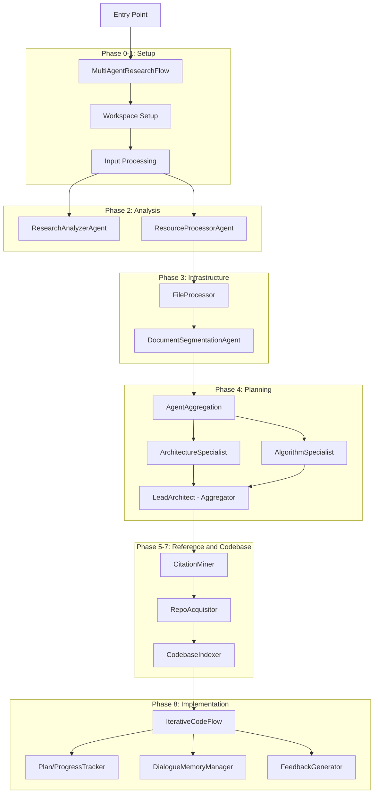

# DeepCode LangGraph Migration Plan

## Current Architecture Analysis

The existing `deepcode/` project is a multi-agent paper-to-code reproduction system built on the **openjiuwen** framework. It uses:

- **openjiuwen** for agent runtime, LLM model factory, message types, tool management, and context engine
- **MCP (Model Context Protocol)** stdio servers for tools (search, file ops, code execution, doc segmentation, etc.)
- A multi-phase pipeline (`MultiAgentResearchFlow`) that orchestrates specialized agents

### Architecture Diagram




## Framework Dependency Mapping

- `openjiuwen.core.utils.llm.messages.*` -> `langchain_core.messages`
- `openjiuwen.core.utils.llm.model_utils.model_factory.ModelFactory` -> `langchain_openai.ChatOpenAI` / `langchain_anthropic.ChatAnthropic` / `langchain_google_genai.ChatGoogleGenerativeAI`
- `openjiuwen.core.utils.tool.mcp.base.ToolServerConfig` + `resource_mgr.tool()` -> `langchain_mcp_adapters` (MCP stdio client)
- `openjiuwen.core.context_engine` -> LangGraph state management
- `openjiuwen.core.common.logging.logger` -> Python `logging` module
- `ReActAgent` (custom tool loop) -> LangGraph `create_react_agent` or custom `StateGraph`
- `AgentAggregation` (fan-out + aggregate) -> LangGraph `StateGraph` with parallel branches
- `MultiAgentResearchFlow` (sequential phases) -> LangGraph `StateGraph` with phase nodes
- `IterativeCodeFlow` (while loop with tool calls) -> LangGraph `StateGraph` with conditional loop edges

## New Project Structure

```
deepcode_langgraph/
├── README.md
├── requirements.txt
├── .env.example
├── config.yaml
├── agents/
│   ├── __init__.py
│   └── react_agent.py
├── agent_flow/
│   ├── __init__.py
│   ├── agent_aggregation.py
│   ├── multi_agent_research.py
│   ├── code_implementation_flow_iterative.py
│   ├── codebase_agent.py
│   └── codebase_intelligence_summary.py
├── prompts/
│   ├── sys_prompts.py
│   └── user_prompts.py
├── tools/
│   ├── bocha_search_server.py
│   ├── code_implementation_server.py
│   ├── code_reference_indexer.py
│   ├── command_executor.py
│   ├── document_segmentation_server.py
│   ├── git_command.py
│   └── pdf_downloader.py
├── utils/
│   ├── __init__.py
│   ├── cli_interface.py
│   ├── code_indexing_utils.py
│   ├── cross_platform_file_handler.py
│   ├── dialogue_logger.py
│   ├── file_processor.py
│   ├── llm_utils.py
│   ├── mcp_tool_manager.py  (NEW: centralized MCP tool management)
│   ├── simple_llm_logger.py
│   └── utils.py
└── tests/
    ├── try_multi_agent_research.py
    ├── test_agents/
    │   └── test_react_agent.py
    └── test_tools/
        └── test_code_reference.py
```

## Detailed Conversion Plan

### 1. Foundation: Dependencies and Configuration

`**requirements.txt**` - Core dependencies:

- `langchain-core`, `langchain-openai`, `langchain-anthropic`, `langchain-google-genai`
- `langgraph`
- `langchain-mcp-adapters` (for MCP tool integration)
- `pydantic`, `python-dotenv`, `pyyaml`, `aiofiles`

`**config.yaml**` - Adapt from `[deepcode/mcp_agent.config.yaml](deepcode/mcp_agent.config.yaml)`, keep the same MCP server definitions and settings.

`**.env.example**` - Environment variables for LLM API keys and tool paths.

### 2. Agent Layer: `agents/react_agent.py`

**Key changes**: Replace `openjiuwen` message types, model factory, and MCP tool management with LangChain equivalents.

- `**BaseAgent`**: 
  - Replace `ModelFactory().get_model()` with LangChain model construction (`ChatOpenAI`, etc.) based on `model_provider` in config
  - Replace `resource_mgr.tool().add_tool_servers()` with `langchain_mcp_adapters.MultiServerMCPClient` for MCP tool loading
  - Replace `mcp_to_openai_tool()` conversion with LangChain's native tool binding (`model.bind_tools(tools)`)
  - Replace `execute_mcp_tool()` with direct tool invocation via LangChain `Tool.ainvoke()`
- `**ReActAgent**`: 
  - Replace the manual while-loop (`while response.tool_calls`) with a LangGraph `create_react_agent` graph, or a minimal custom `StateGraph` with `call_model` and `call_tools` nodes
  - Message types: `openjiuwen.*Message` -> `langchain_core.messages.*`
- `**ChatAgent**`: 
  - Replace `self._llm.ainvoke()` with `ChatOpenAI().ainvoke(messages)`

### 3. MCP Tool Manager: `utils/mcp_tool_manager.py` (NEW)

Create a centralized MCP tool management utility:

- Uses `langchain_mcp_adapters.MultiServerMCPClient` to connect to MCP stdio servers
- Reads server configs from `config.yaml` (same format as original `mcp_agent.config.yaml`)
- Provides `async get_tools(server_names: list) -> list[BaseTool]`
- Handles MCP session lifecycle (connect, disconnect)

### 4. Agent Aggregation: `agent_flow/agent_aggregation.py`

Convert `AgentAggregation` to use LangGraph:

- Create a `StateGraph` where each source agent runs as a parallel branch
- Results are merged into state, then the aggregator agent processes them
- Alternatively, keep the simpler async pattern (concurrent `ainvoke` calls) since LangGraph supports both

### 5. Multi-Agent Research Flow: `agent_flow/multi_agent_research.py`

Convert `MultiAgentResearchFlow` to use LangGraph/LangChain:

- Replace `openjiuwen` imports with LangChain equivalents
- Replace `ToolServerConfig`/`StdioServerParameters` with `langchain_mcp_adapters` config
- Replace `ReActAgent` creation with LangChain/LangGraph agent creation
- Keep the same phase structure (Phase 0-9) and orchestration logic
- Use LangChain's `ChatOpenAI`/etc. for LLM calls via agents

### 6. Iterative Code Flow: `agent_flow/code_implementation_flow_iterative.py`

Convert `IterativeCodeFlow`:

- Replace `openjiuwen` message types with `langchain_core.messages`
- Replace `self._agent.call_llm()` with LangChain model invocation (`model.invoke(messages, tools=...)`)
- Replace `self._agent.execute_mcp_tool()` with LangChain tool invocation
- Keep the existing `Plan`, `DialogueMemoryManager`, `AdvancedJsonRepairer`, `IterativeFeedbackGenerator`, `EssentialToolFilter` classes (they have minimal framework dependency)
- Replace `ContextEngine` usage in `DialogueMemoryManager` with simple list-based state management

### 7. Codebase Agents: `agent_flow/codebase_agent.py` and `codebase_intelligence_summary.py`

- Replace `ChatAgent` usage with LangChain `ChatOpenAI().ainvoke()`
- Replace `AgentConfig` construction with direct LangChain model instantiation
- Keep analysis logic (file processing, relationship finding) unchanged

### 8. Utils: `utils/llm_utils.py`

- Remove `mcp_agent.workflows.llm.*` imports
- Replace with LangChain model class selection logic
- Keep the same public API: `get_preferred_llm_class()`, `get_token_limits()`, `get_default_models()`, etc.

### 9. Prompts, Tools, Other Utils

- `**prompts/**`: Copy as-is (prompts are framework-independent)
- `**tools/**`: Copy as-is (MCP stdio servers are standalone Python scripts)
- `**utils/utils.py**`, `**utils/file_processor.py**`, `**utils/code_indexing_utils.py**`, etc.: Copy as-is (no framework dependencies)
- `**utils/cli_interface.py**`, `**utils/dialogue_logger.py**`, etc.: Copy as-is

### 10. Tests

- Update imports from `examples.deepcode_agent.*` to `deepcode_langgraph.*`
- Replace agent construction with LangChain/LangGraph equivalents
- Keep the same test scenarios

## Key Design Decisions

- **MCP Integration**: Use `langchain-mcp-adapters` library which provides `MultiServerMCPClient` for connecting to MCP stdio servers as LangChain tools. This is the cleanest mapping from the original `ToolServerConfig` + `resource_mgr` pattern.
- **ReAct Agent**: Use LangGraph's built-in `create_react_agent` for simple cases (tool loop), and custom `StateGraph` for `IterativeCodeFlow` which has complex memory management and progress tracking.
- **Message Types**: Direct 1:1 mapping from `openjiuwen` messages to `langchain_core.messages`.
- **Package Structure**: Mirror the original `deepcode/` layout exactly, just under `deepcode_langgraph/`.
- **Import Paths**: Use `deepcode_langgraph.`* instead of `examples.deepcode_agent.*`.

